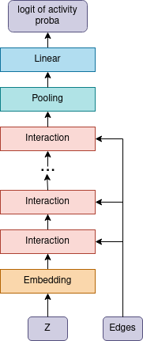
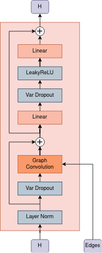

# Global AI Challenge: Ligand Activity Prediction

Competition https://codenrock.com/contests/global-ai#/info

## Representation

A molecule is represented as a graph, where the nodes are atoms,
and chemical bonds are represented by graph edges. 
We considered 4 types of bonds: single, double, triple, and aromatic.

## Model Architecture

The model consists of an encoder which builds a vector representation of each atom,
the pooling layer maps all vectors of atoms into one vector,
the linear layer gives the logit activity probability of the molecule. 
Encoder consists of L=4 layers, each of which includes layer norm at the beginning,
graph convolution and atom-wise feedforward layer. In graph convolution layer 
for each type of edge its own weight matrix is used.

Remarks:
* two types of pooling layers were considered: mean pooling and attention pooling 
* We use [variational dropout](https://arxiv.org/abs/1705.07283)
* Using variational dropout causes the model output to become a random value

architectural overview | interaction block
|----------------------|-------------------------
  |  

The model is implemented using [pytorch-geometric](https://pytorch-geometric.readthedocs.io)

## Data Preprocessing 

Preprocessing algorithm:
1. Converting SMILES to a graph using RDKit.
2. For a disconnected molecular graph, choose the largest connected subgraph.

Remarks: There is no check for duplicates, which can have a bad effect on the model evaluation.

## Training 

The imbalance active/non-active = 5351/206 was solved by duplicating positive examples 20 times.

Train/dev split algorithm:
1. Set the seed for the pseudo-random number algorithm.
2. Shuffle the training data.
3. Split positive and negative examples.
4. (Optional) Reverse the data order.
5. Separate the first 0.25 examples of positive and 0.25 examples of negative data into a dev sample.
6. From the remaining examples, we form a training sample. Positive examples are duplicated 20 times.

### Mean-Pooling Model

The python script implementing training `/scripts/train_v1.py` was launched via `/scripts/train_v1.sh`.
Model has L=4 encoder's layers, vector representation size is H=32.
We use mean-pooling for the vector representation of the structure.
Each model is trained for 20,000 epochs.
After training, we make a prediction on dev and test sets.
We use predictions on the dev's set to find the optimal threshold of the positive class maximizing f1, while we assume that
we have the ratio of negative examples to positive ones as 5000:200 (this is not the right ratio).
A molecule is considered active if more than T models consider it active. 

### Attention-Pooling Model

The python script implementing training `/scripts/train_v4.py` was launched via `/scripts/train_v4.sh`.
Model has L=4 encoder's layers, vector representation size is H=32.
We use mean-pooling for the vector representation of the structure.
In the process of model training, its quality is estimated on the dev set and, for further
prediction, the best model is used. The model makes predictions for dev and test sets.
We use the prediction on the dev set to find a threshold.
A molecule is considered active if more than half of the models consider it active. 

## Experiments

Observations:
* The train/dev split significantly affects the model quality estimation.
* The quality of the model is strongly affected by the initial initialization of the weights.
* Reducing the learning rate in the process of training the model does not affect the quality. 
* No noticeable effect of the amount of duplication of positive examples, weight decay, dropout weight or entropy weight was found.
